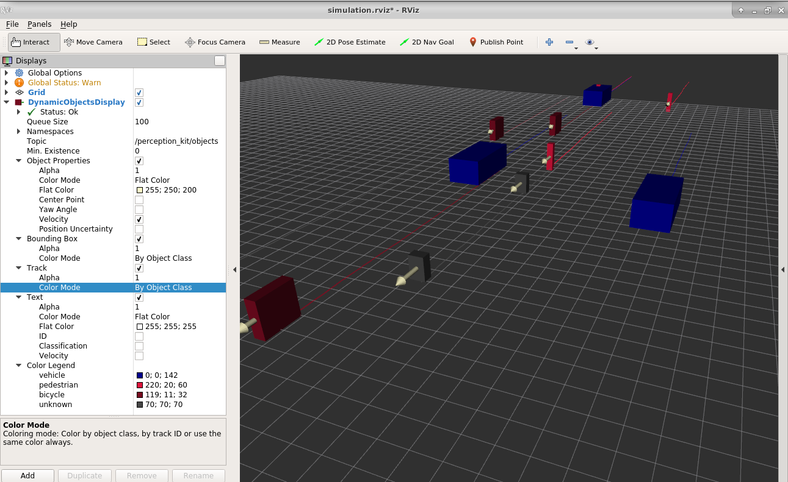
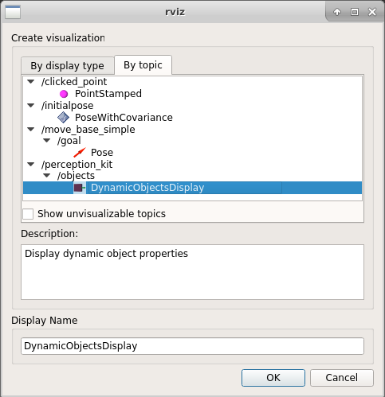
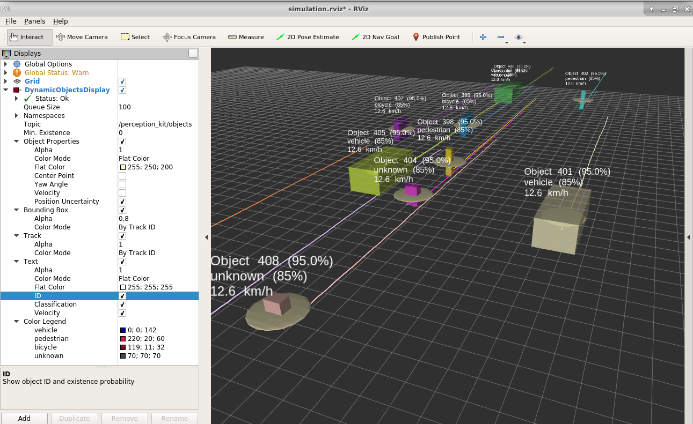

# Perception Kit Visualization  <!-- omit in toc -->

[](https://inside-docupedia.bosch.com/confluence/display/SCOS/BIOS+License+V4)
[](http://asy-ci-ape.rng.de.bosch.com:8080/job/perception_kit_visu/job/master/)

This repository contains RViz plugins for visualization of [perception_kit_msgs](https://sourcecode.socialcoding.bosch.com/projects/PERCEPTION_KIT/repos/perception_kit_msgs/browse) data. Dynamic object lists for example are visualized by default similar to this screenshot:

]

## Getting Started
Clone the required packages inside a ROS workspace:
* [perception_kit_msgs](https://sourcecode.socialcoding.bosch.com/projects/PERCEPTION_KIT/repos/perception_kit_msgs/browse) and
* [perception_kit_visu](https://sourcecode.socialcoding.bosch.com/projects/PERCEPTION_KIT/repos/perception_kit_visu/browse) (this repository).

Build your workspace as usual. RViz will find the needed files on its own after you source the ```devel/setup``` file of your workspace after building. For example, run
```
cd /path/to/my/workspace
catkin build
source devel/setup.bash
rviz
```

Please replace ```/path/to/my/workspace``` above with your actual workspace directory. Source ```setup.zsh``` if you are running ZSH instead of Bash.

## Usage
The dynamic object display plugin works when two requirements are met:
* At least one ROS publisher provides a topic with ```perception_kit_msgs/Objects``` data
* RViz is running after sourcing a workspace containing the ```perception_kit_visu/DynamicObjectsDisplay``` plugin as described in the section above.

To start the visualization in RViz:
* Ensure the ```Displays``` panel is visible. Use the ```Panels``` menu to reveal it or create a new ```Displays``` panel if that is not the case.
* Click on the ```Add``` button on the bottom left of the ```Displays``` panel.
* In the upcoming dialog, click on the ```By topic``` tab.
* Scroll down up to the topic you want to visualize and select the ```DynamicObjectsDisplay``` entry.
* Optionally adjust the ```Display Name``` in the field with the same name to better reflect the data you are visualizing.
* Click on ```OK```. The visualization of the data will start immediately.

]

### Troubleshooting

If the ```DynamicObjectsDisplay``` does not show up in the ```Add``` dialog as described above, please follow these steps:

1. Click on the ```Add``` button in the ```Displays``` panel to bring up the ```Create visualization``` dialog.
2. In the ```By display type``` tab, check that a folder ```perception_kit_visu``` exists with an entry ```DynamicObjectsDisplay```.
3. If the entry does not exist, repeat the installation steps from the *Getting Started* section. Make sure the workspace containing the ```perception_kit_visu``` package is build. Make sure this workspace is sourced by the RViz instance you're running. Depending on your setup you might have to re-login or reboot for changes to have effect on RViz.
4. If the entry does exist in the ```By display type``` tab but not in the ```By topic``` tab, there is no ROS publisher providing ```perception_kit_msgs/Objects``` data. You can run ```rosrun perception_kit_visu perception_kit_visu_object_simulation``` to start a publisher with simulated data in order to test your installation.

### Configuration

The plugin provides several options to adjust its look and feel:
* The ```Topic``` field can be changed to switch between different providers of ```perception_kit_msgs/Objects``` data. Note that you can also add multiple instances of the ```DynamicObjectsDisplay``` to visualize several data providers simultaneously.
* The ```Min. Existence``` threshold can be increased from its default value ```0.0``` to a higher value up until ```1.0```. Objects with a reported existence probability lower than the configured ```Min. Existence``` will not be visualized.

There are eight visual features that can be shown/hidden and configured:
* The bounding box of the object (```Bounding Box``` field group)
* The path of historic object positions (```Track``` field group)
* Textual descriptions of object features (```Text``` field group)
* The center point of the object (```Object Properties/Center Point``` field)
* The yaw angle of the object (```Object Properties/Yaw Angle``` field) indicated by the direction of an arrow
* The velocity of the object (```Object Properties/Velocity``` field) indicated by the direction and shaft length of an arrow
* The center point of the object (```Object Properties/Center Point``` field)
* The position uncertainty (```Object Properties/Position Uncertainty``` field) indicated by an ellipse, based on examining a subset of the covariance matrix.

Colors can be configured to choose between three color modes:
* ```Flat Color``` colors all elements of the group in a single, fixed, but configurable color.
* ```By Track ID``` colors all elements of the group based on the object ID. Each ID value is assigned one of twenty visually distinct colors.
* ```By Object Class``` colors all elements of the group according to their ```obj_class``` with the highest confidence value. The class names and colors are taken from the popular [Cityscapes Dataset](https://www.cityscapes-dataset.com/). The known classes are ```ego vehicle```, ```road```, ```sidewalk```, ```parking```, ```rail track```, ```building```, ```wall```, ```fence```, ```guard rail```, ```bridge```, ```tunnel```, ```pole```, ```polegroup```, ```traffic light```, ```traffic sign```, ```vegetation```, ```terrain```, ```sky```, ```person```, ```pedestrian```, ```rider```, ```car```, ```vehicle```, ```truck```, ```bus```, ```caravan```, ```trailer```, ```train```, ```motorcycle```, ```bicycle``` and ```license plate```. When other ```obj_class``` values appear, a color from the same set of colors is assigned randomly. The used ```obj_class``` values and their colors are listed in the ```Color Legend``` field group.
* ```By Attribute``` colors all elements of the group according to the value of an object attribute. The attribute value should be in the range [0,1]. The user can choose from several standard Matlab and matplotlib colormaps.

An example of a possible configuration is shown in the next screenshot:

]

## About

For contribution guidelines and feedback please refer to [perception_kit](https://sourcecode.socialcoding.bosch.com/projects/PERCEPTION_KIT/repos/0_perception_kit/browse/README.md).

|                    |         |
| -------------------|---------|
| Maintainers        | <a href="mailto:tobias.baer3@de.bosch.com">Tobias Bär</a>, <a href="mailto:dennis.nienhueser@de.bosch.com">Dennis Nienhüser</a> |
| Used Encryption    | No custom encryption is used (see BIOS Repository Policy §4.a) |
| 3rd party licenses | [MIT](LICENSES/MIT-tinycolormap.txt) |

### 3rd Party Licenses <a name="3rd-party-licenses"></a>

| Name | License | Type |
|------|---------|------|
| [tinycolormap](https://github.com/yuki-koyama/tinycolormap) | [MIT](LICENSES/MIT-tinycolormap.txt) | Source Code |

### License

[](#license)

> Copyright (c) 2009, 2018 Robert Bosch GmbH and its subsidiaries.
> This program and the accompanying materials are made available under
> the terms of the Bosch Internal Open Source License v4
> which accompanies this distribution, and is available at
> http://bios.intranet.bosch.com/bioslv4.txt
