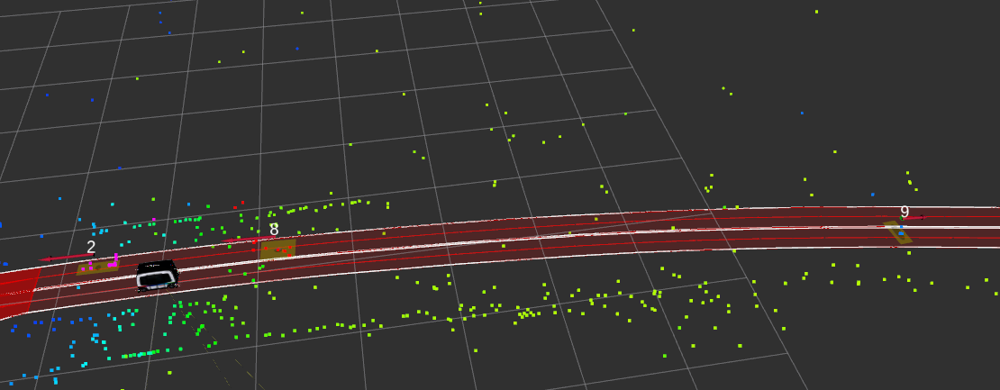
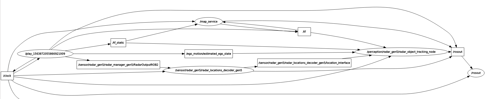
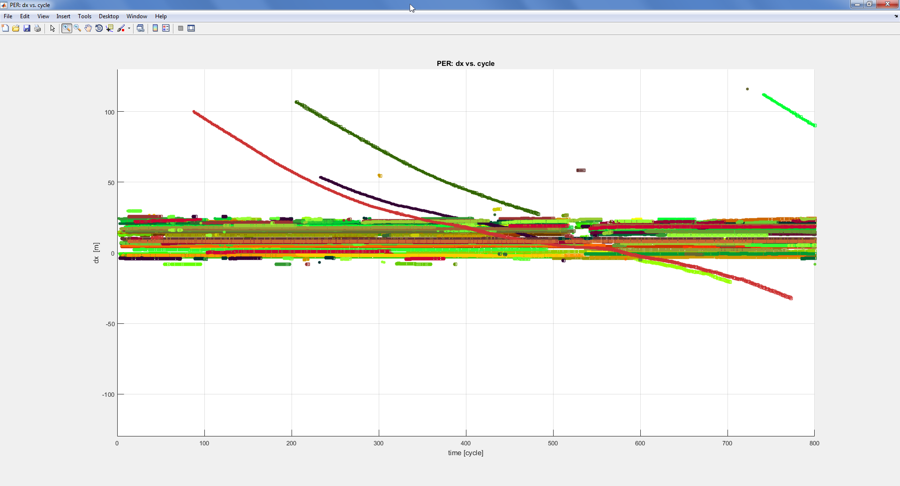
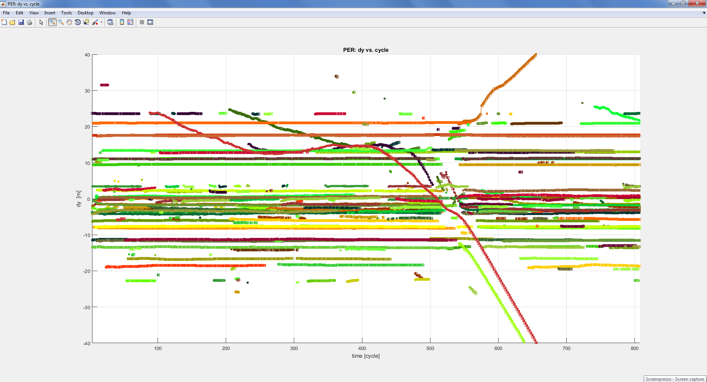
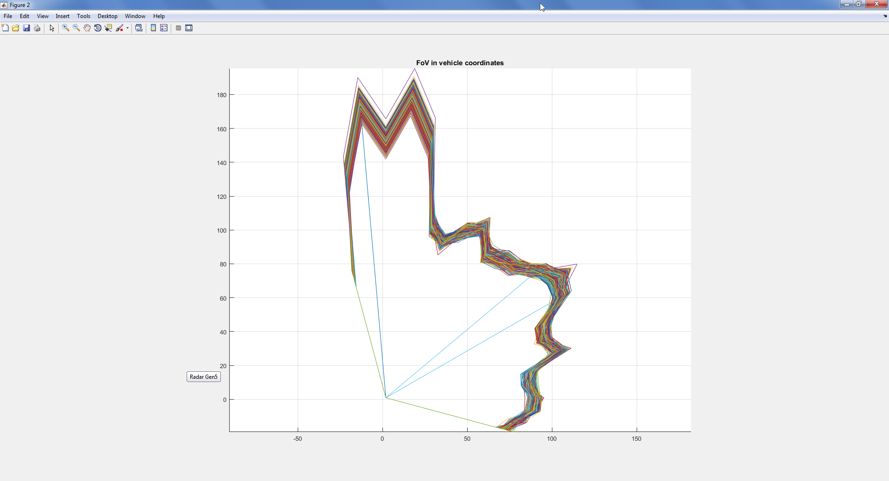

## The radar tracking package

ROS wrapper for the radar linear kalman filter 6D tracking, including Matlab sources. The tracker can subscribe to an (theoretically) arbitrary number of radar location publishers and will itself publish kalman tracked (and in future classified) objects. Multiple instances of the tracker can run in parallel for comparison of e.g. single vs. fusion sensor configuration. Below picture e.g. shows a configuration with 4 corner radars and 3 trackers, whereof 2 trackers are single-sensor and one tracker fuses the locations or radars front left + front right

See history for related information and documentation, see below for usage

## History and further information:

2018
Adaptation to Bosch Radar Gen5 by Joachim Börger (CR/AEV4) <Joachim.Boerger@de.bosch.com> and Michael Ulrich (CR/AEV4) <Michael.Ulrich2@de.bosch.com) 
	- Using local gridmaps for data association (instead of reflex model) 
	- Using local gridmaps for length/width estimation
	- Extension to EKF (true EKF is now used for all 3 IMM models)
	- Excluding stationary locations
	- Egomotion compensation
	- Adaptation to the Gen5 interface of 512 locations and Gen5 specific data verification 
	- Other minor adaptation quick fixes, e.g. Field of View in lkf_6D_flagsinit.m
	- Code generation Matlab to Cpp for the ROS version of the tracker was updated to Matlab 2018
	- Data import, export, visualization is now handled in SWX format instead of ShowWorldX allowing for compatibility and data exchange

2015
Original implementation for Bosch Radar Gen4 by Rüdiger Jordan (CR/AEV2) <Ruediger.Jordan@de.bosch.com> in context of the CR project "intersection assist". Further information
	- Documentation of the original tracking: \\bosch.com\dfsrb\DfsDE\DIV\CR\AE1\AEV\Filebase\Internal\aev2\P_Projekte\222_AEV_222_Kreuzungen\40_Berichte\Dokumentation_Projektphase_1\150415_Projektphase1_MRRcorner_basierter_Querverkehrsassistent_final.pdf
		"Projektphase 1 - MRRcorner basierter Querverkehrsassistent", 15.04.2015, AEV 15/006
	- Original Matlab code and ADTF wrapper are available on \\bosch.com\dfsrb\DfsDE\DIV\CR\AE1\AEV\Filebase\Internal\aev2\P_Projekte\222_AEV_222_Kreuzungen\80_Software\ADTF\Filter\perception
		SVM data (for classification) can also be found in the above folders

	
## Directory and file contents 

- Matlab-sources can be found in ./matlab
- Generated code will be generated in ./matlab/codegen (not under version control), approved generated code is stored under version control in ./src/radar_tracker_matlab_wrapper/radar_tracker
- C++ class CRadarLKF6DMatlabWrapper encapsulates the memory structures for the matlab generated code and also offers simple interfaces to 
	fill data into the tracker
- C++ ROS class CShuttleToMatlabTrackingBridge creates subscribers and publishers to fill Radar sensor data (and in future 
	Shuttle movement data) to the Matlab Wrapper, calls the Tracker mainloop, and published the result to ROS
	
	
## Usage

Running the tracker in your ROS world:
- Make sure radar locations are available in the system, normally by running the radar_gen5 manager and decoder
- Adapt radar_object_tracking_fused.launch or any other suitable .launch file to your system
- Then launch it via roslaunch radar_object_tracking radar_object_tracking_fused.launch
- Enjoy the result in RViz by visualizing obstacles/radar_gen5/objects_point_cloud in RViz
- Or explore the result more sophistically by visualizing obstacles/radar_gen5/tracks using the special plugin 
- Record a movie with Kazam or simply make a screenshot and let us know your experience :-)

Change, improve, adapt... the tracker
- How to work in Matlab: Open radar_tracker_testbench.m and follow the documentation there
- How to generate Cpp-Code for the ROS node: Open radar_tracker.prj and follow the instructions there

## Example data

See directory ./doc

Example data with tracked objects

Topics and connections required for the radar tracking node

Matlab evaluation of tracked objects with a fusion system of 2 radars - Longitudinal distance dx

Matlab evaluation of tracked objects with a fusion system of 2 radars - Lateral distance dy

FoV Plot

## About 

### 3rd Party Licenses 

| Name | License | Type |
|------|---------|------|
| Matlab Coder auto-generated code |  | Included in [radar_tracker/](src/radar_tracker_matlab_wrapper/radar_tracker/)
| C-program for MT19937 | [BSD-3](https://opensource.org/licenses/BSD-3-Clause) | Included in [rand.cpp](src/radar_tracker_matlab_wrapper/radar_tracker/rand.cpp)

### Used Encryption 

No custom encryption is used (see BIOS Repository Policy §4.a).

### License 

> Copyright (c) 2009, 2018 Robert Bosch GmbH and its subsidiaries.
> This program and the accompanying materials are made available under
> the terms of the Bosch Internal Open Source License v4
> which accompanies this distribution, and is available at
> http://bios.intranet.bosch.com/bioslv4.txt

<!---

	Copyright (c) 2009, 2018 Robert Bosch GmbH and its subsidiaries.
	This program and the accompanying materials are made available under
	the terms of the Bosch Internal Open Source License v4
	which accompanies this distribution, and is available at
	http://bios.intranet.bosch.com/bioslv4.txt

-->