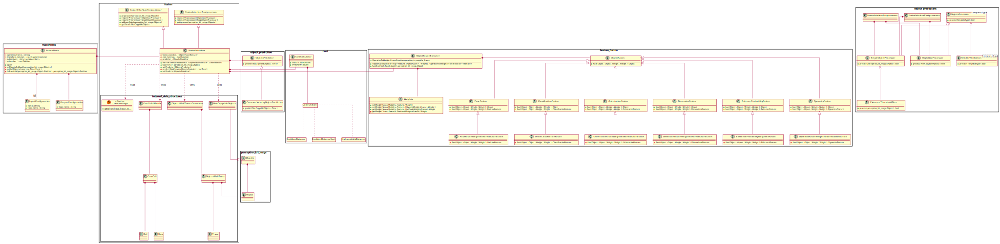
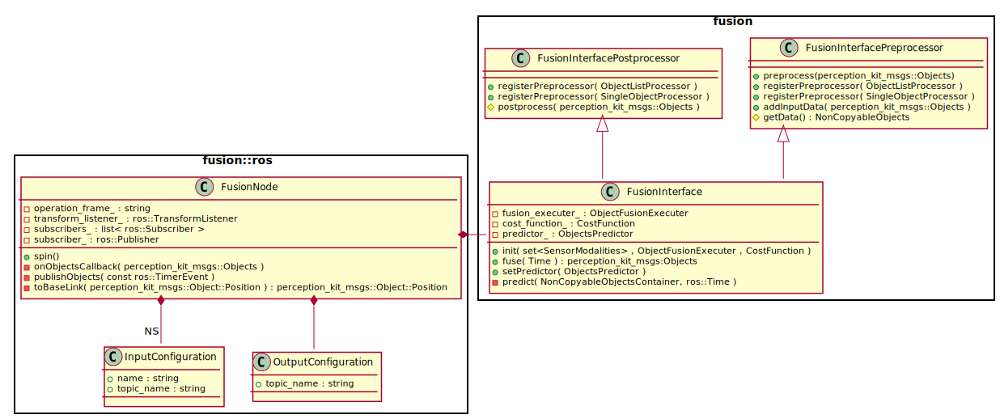
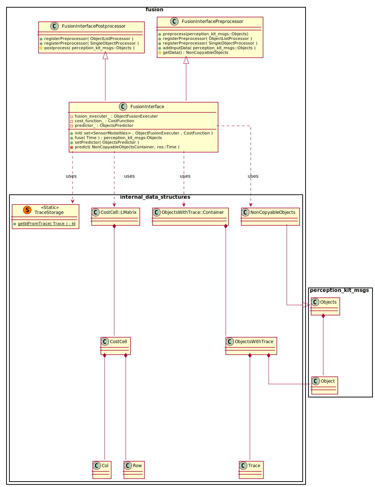
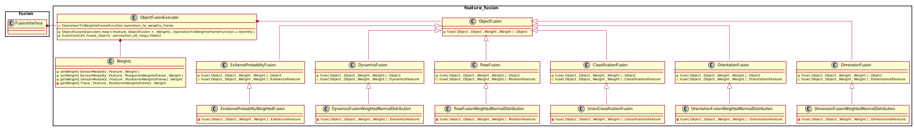
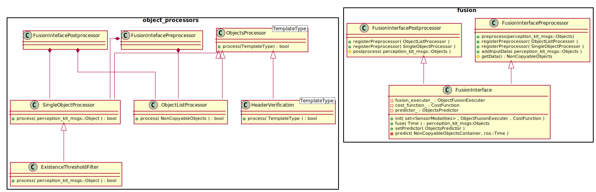
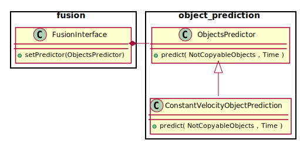

<!---

	Copyright (c) 2009, 2018 Robert Bosch GmbH and its subsidiaries.
	This program and the accompanying materials are made available under
	the terms of the Bosch Internal Open Source License v4
	which accompanies this distribution, and is available at
	http://bios.intranet.bosch.com/bioslv4.txt

-->

# Track To Track Fusion  <!-- omit in toc -->

[](#license)
[](http://si-z0l9v.rng.de.bosch.com:8080/job/track_to_track_fusion/job/master/)
[](http://asy-ci-ape.rng.de.bosch.com:8080/job/track_to_track_fusion/job/master/cobertura/graph)

The **Track to Track Fusion** fuses tracked objects of different sensor modalities and emits one consistent output list.

The input of the different sensor modalities is expected to be of type `perception_kit_msgs::Objects`. The operation
coordinate system of the fusion ("frame" in ROS speaking) can be specified in the config file.
All input objects need to be in the operation frame. In case different sensor modalities publish their objects in
different coordinate systems, the
[perception kit object transform](https://sourcecode.socialcoding.bosch.com/projects/PERCEPTION_KIT/repos/perception_kit_object_transform/browse)
can be used for the transformation of the inputs. More to that in the [getting started section](#getting-started)

The **Track to Track Fusion** is conducted in a feature based, weighted manner. Let's assume you have two different
sensor modalities: A radar sensor, which has a very good precision on determining the objects velocity and a lidar
sensor, which has its strength in estimating the objects dimension. By specifying a according weight for each sensor on 
feature level, you are able to fuse the object combining the strengths of both sensor. You can even specify individual
weights for particular regions. More to that in the [setup weights section](#weights).

Due to the modular concept of the **Track to Track Fusion**, it is highly extendable and configurable to your project
specifics. From the high level perspective, the **Track to Track Fusion** does:
 * a pre-processing of the input data
 * a short term prediction of the objects to the current fusion time
 * a calculation of the *fusion costs* of each object pairs
 * iteratively fuse two objects in a commutative and associative manner, as long as the fusion cost of two objects is
   below a certain threshold.
 * a post-processing the fusion result

All those steps are adaptable to your project or sensor specifics:
You can (but of course do not need to) implement your own pre- and post-processors by deriving from the
`ObjectProcessor` class.
You can write your own prediction by deriving from the `ObjectPrediction` class.
You can provide your own cost function by overloading the `CostFunction` and, you can write your own object fusion
method by deriving from the `ObjectFusion` class.
More to this in the [software architecture section](#software-architecture).

The **Track to Track Fusion** comes with unit tests, as well as an evaluation package, containing integration tests and
KPIs. More to this in the [building and testing section](#building-and-testing).

Your contribution and feedback is welcome! Do not hesitate to contact <Tobias.Baer3@de.bosch.com> or drop a line into
our MS-Team-Room mentioned in the [about section](#about). There's always something to do! Our work is tracked in our
[JIRA project page](https://rb-tracker.bosch.com/tracker01/secure/RapidBoard.jspa?rapidView=7725) major limitations and
known issues are listed in the [opens sections](#opens).

Happy coding!

## Table of Contents  <!-- omit in toc -->

- [Getting Started](#getting-started)
- [Building and Testing](#building-and-testing)
- [Open Issues](#opens)
- [About](#about)
  - [Maintainers](#maintainers)
  - [Contributors](#contributors)
  - [3rd Party Licenses](#3rd-party-licenses)
  - [Used Encryption](#used-encryption)
  - [License](#license)

## Getting Started <a name="getting-started"></a>

If you do not bother about setting everything up neatly and you rather want to have something running on your machine
immediately, there is a [very brief manual for the impatient](Impatient.md).

The **Track to Track Fusion** is organized as [ROS](http://ros.org) package and can be integrated into your catkin
workspace (`${CATKIN_WS}`) as follows:

```
$ cd <your_catkin_workspace>/src
$ git clone ssh://git@sourcecode.socialcoding.bosch.com:7999/perception_kit/track_to_track_fusion.git
$ git clone ssh://git@sourcecode.socialcoding.bosch.com:7999/perception_kit/perception_kit_msgs.git

$ catkin build track_to_track_fusion
```

After cloning and building, you need to launch the **Track to Track Fusion** somewhere in your launch file structure. To
launch the fusion, append the following in your projects launch file:

```
<launch>
  <!-- Unit under test -->
  <include file="$(find track_to_track_fusion)/launch/track_to_track_fusion.launch" >
    <arg name="config_file"  value="$(find your_projects_config_files)/config/fusion.yaml" />
    <arg name="weights_file" value="$(find your_projects_config_files)/config/fusion_weights.yaml" />
  </include>
</launch>

```
As you might have noticed, you need two more files, which may be best places somewhere in your project specific config
file folder:

### Config File <a name="config_file"></a>
The first file is the configuration file of the fusion. It specifies the inputs and the outputs, as well
as the operation frame. An example is within the config folder of this repository. This config file can look like this

```
inputs:
  radar:
    topic_name: /perception/radar_gen5/tracks
    min_existence_probability: 0.5
  lidar:
    topic_name: /perception_kit/lidar/obstacles
    min_existence_probability: 0.5

output:
  topic_name: /obstacles/dynamic
  min_existence_probability: 0.5

operation_frame: odom

```
If configured like this, the **Track to Track Fusion** fuses the sensor modalities `radar` and `lidar`. The names
for the sensor modalities can be freely chosen. The objects of the `radar` sensor modality are expected to be
published on topic `/perception/radar_gen5/tracks` and every object below an existence probability of `0.5` is not
considered in the fusion. Same applies for the `lidar` sensor modality.
The output of the fusion is published on the topic `/obstacles/dynamic`. Objects below an existence threshold of `0.5`
are omitted.
The as `operation_frame`, the `odom` frame is specified. Hence, all inputs are expected to be in the `odom` frame. If
this is not the case, the
[perception_kit_object_transform](https://sourcecode.socialcoding.bosch.com/projects/PERCEPTION_KIT/repos/perception_kit_object_transform/browse)
can be used to transform an object list into another coordinate frame.
The `odom` frame is recommended as operation frame, as this frame is continuous. However, the operation frame can be
freely chosen.

### The Weights File  <a name="weights"></a>
The second file required is specifying the weights of the sensor modality features. This file can actually be empty. 
However, in most cases your sensors have strength and weaknesses which you might want to balance by specifying
particular weights. In case of an empty file, all weights are equally set to `1.0`.
An example of the weights file can look like this:

```
weights:
 radar:
  dynamics: 0.8
  position:
    polygon_0:
      wkt: "POLYGON((-5 -5, -5 5, 5 5 , 5 -5))"
      value: 0.1
    default:  0.7
    publish_marker: True
  dimensions: 0.2
  existence_probability: 0.7
 lidar:
  dynamics: 0.2

weights_frame: "base_link"
```

In this case, the sensor modality `radar` has a much larger contribution to the dynamics (velocity and acceleration)
feature as the `lidar` (here, the sensor modality names need to match the ones from the config file above). With this
setup, the velocity fusion would (simplified) look like: `v.x = (0.8 * radar.v.x + 0. 2 * lidar.v.x) / (0.8 + 0.2)`.
The weights do not necessarily sum up to one. However, this is recommended to get a better overview of your
configuration.

Furthermore, you can specify specific weights for regions. In this case for instance, the position weight of the radar
is `0.1` for the region `[+/-5,+/-5]`. The defined region is relative to the `weights_frame` defined. The weights frame
is usually a frame pinned to the vehicle as the sensors are usually fixed to the vehicle, too.
This can be handy, if you know, that your sensor has weaknesses in particular regions. For instance when looking at
radar data, it happens that the reflections get wrongly estimated on overtaking objects. Having the effect as if the
object is magnetically pulled towards your car. Of course, this should be fixed in the radar tracker then, however, to
cope with effects like this, region defined weights can be used.

@todo: Image of shuttle measurement where exactly this happens

## Building and Testing <a name="building-and-testing"></a>

This repository is a catkin package. Building it is done via:

```
cd <this_package>
catkin build --this
```

Unit tests can be executed by

```
cd <this_package>
catkin run_tests --this
```

The fusion comes with an evaluation package, containing KPI generation and different test cases of different system
projects. Furthermore, there is a visualization package for the `perception_kit_msgs::Objects` which comes in handy in
case you want to visualize your fusion input and results with `RViz`.

The evaluation package and the visualization package can be pulled and build with

```
cd <your_catkin_workspace>/src
$ git clone ssh://git@sourcecode.socialcoding.bosch.com:7999/perception_kit/perception_kit_visu.git
$ git clone ssh://git@sourcecode.socialcoding.bosch.com:7999/perception_kit/track_to_track_fusion_evaluation.git
$ catkin build track_to_track_fusion perception_kit_visu track_to_track_fusion_evaluation
```

Depending on the tests, you need some measurements on your machine. The measurements are listed in
the `kpi/measurements.txt` file of the `track_to_track_fusion_evaluation` package. Once downloaded, you can start a particular scene
with:

```
$ roslaunch track_to_track_fusion_evaluation demo_rviz.launch test_name:=<test_name>
```

as for instance:

```
$ roslaunch track_to_track_fusion_evaluation demo_rviz.launch test_name:=SHU_001
```

As usual for a perception kit package, KPIs can be generated with
```
cd track_to_track_fusion_evaluation
./kpis/generate_kpis  # @todo: There are no KPIs at the moment
```

## Software Architecture <a name="software-architecture"></a>

This section aims to look under the hood of the **Track To Track Fusion** and explains the used classes, data structures
and the processing flow. The full UML class diagram of the can be seen below. As source code, it is included in the
`plantuml` folder of this repository.



### The ROS Interfacing

The entry point of the fusion is the `FusionNode`. It does the **ROS** interfacing part of the 
functionality. This is:
 * reading the fusion configuration by means of reading it from the ROS parameter server
 * advertising and subscribing of topics
 * providing a method to convert a position from the operation frame to the frame the weights are
   defined in
 * forwarding incoming data to the `FusionInterface` by calling the `addData()` function
 * periodically trigger the fusion interface, fetch and publish the results

Furthermore, it does the complete setup of the `FusionInterface` instance. This is creating ...
 * the pre-processors and the post-processors and registering them
 * the fusion executer, including its weights and object fusion instances
 * the prediction instance and registering it
 * the cost function and passing it to the fusion 



In summary, the `FusionNode` handles the setup of the `FusionInterface` and everything **ROS** dependent. Thus, all
other sub-packages of the fusion can be independent from **ROS** (though using the the logging mechanisms and data 
definitions).

### The Fusion Interface

The fusion interface contains the `fuse()` function, which is (very surprisingly) fusing the received objects of the
different sensor modalities. It ...

 1. calls the `getData()` function to get all data in a preprocessed manner. The `getData()` function returns the 
    pre-processed data in form of a `NonCopyableObjects` structure. This structure is derived from the
    `perception_kit_msgs::Objects` but with deleted copy-constructor and -operator. Thus, the programmer is forced to 
    operate on the objects its-self avoiding unnecessary copy overhead.

 1. predicts the data to the current timestamp using the predictor set by the `FusionNode`.

 1. creates a list of all objects (`ObjectsWithTrace::Container`) of all sensors and calculates the cost of each object 
    to another object. A trace (`Trace`) is appended to every object to track the objects origins.
    
    The calculated fusion costs are stored in a matrix like container (`CostCell::LMatrix`) with 
    each cell (`CostCell`) holding the cost, as well as references to to the row and the column element it is 
    referencing to (`CostCell::Row`, `CostCell::Col`).
    
    Since the fusion does not fuse objects of the same sensor modality, fusion costs of the same sensor modalities are 
    set to infinity. The cost is calculated by the cost function selected and set by the `FusionNode`.

 1. iteratively fuses two objects of the created list using `FusionExecuter::fuse()` function. The new object is added
    to the list, whereas the two fused objects are de-registered. As the fusion of two objects `FusionExecuter::fuse()` 
    is required to be associative and commutative, the order the objects are fused with does not have an impact on the
    fusion result.

 1. assigns an `id` to the resulting fusion objects by comparing the current trace with already seen traces. The trace 
    storage (`TraceStorage`) is implemented as singleton holding the trace history (@todo: can be a usual member I 
    guess).

 1. converts the fusion result to a `perception_kit_msgs::Objects` structure and returns it to the `FusionNode`.

The used classes and their dependencies are expressed in the UML diagram below:



### The Object Fusion <a name="object_fusion"></a>

The fusion of two objects, which is called by the `FusionInterface`, is conducted by the `FusionExecuter::fuse()`
method. The `fuse()` method operates on a `CostCell` as input, which actually holds references to the two objects to
fuse.
The `FusionExecuter` holds one `ObjectFusion` instance for every feature (position, classification, dynamics, ...).
Each feature is fused individually. In general, the fusion routine can be explained in pseudo code as the following:
 * for every feature:
   * for every sensor modality:
     * get position of the cells row and col objects in base link frame
     * get the fusion weight according to the position in base link, the sensor modality and the feature
     * call the registered `ObjectFusion` instance for the particular feature with the corresponding objects and
       weights. The output is restricted to the according feature, which ensures that the fusion of the particular 
       feature does not have any side effects on other features.



### The Pre- and Post-Processors

Before and after the fusion itself, the incoming and outgoing object list can be pre- or post-processed respectively.
Pre- and Post-Processors can be registered in the `FusionInterface` class.
There are two types of processors: Processors processing a single object and processors processing the whole list.
You can implement your own Pre- or Post-Processor deriving from the `ObjectsListProcessor` or the
`SingleObjectProcessor` respectively.
The `ExistenceThresholdFilter` and the `HeaderVerificationFilter` are two final classes of the processors. The `ExistenceThresholdFilter` filters out every object below a certain threshold, and the  `HeaderVerificationFilter`
throws an exception if the header frame is not an expected one.
The `ExistenceThresholdFilter` can be activated by specifying a `min_existence_threshold` in the configuration file ([see section configuration file](#config_file))

The UML class diagram of the processors can be seen below:



### The Object Predictors

Object predictors aim predict an incoming objects position at a certain point in time. There are many ways to conduct
a prediction. One simple way is to forward it assuming a constant velocity.
This is implemented in the `ConstantVelocityPredictor`. Other prediction strategies are possible, maybe pedestrians can
be predicted with a different strategy then cars. For your individual implementation, you can derive from the
`ObjectPrediction` class and implement your individual predict function.



### The Cost Functions

To determine if two objects originating from different sensor modalities are fused into one single instance,
*fusion costs* are calculated. The fusion process terminates if no objects need to be fused anymore, meaning, that all 
fusion costs exceed a certain threshold.
To determine the costs of two objects being fused, the `FusionInterface` holds a `CostCalculator`. The `CostCalculator`
is actually a tuple of `CostFunction` and a threshold.
The `CostFunction` itself is a simple `std::function` taking two objects as input and returning a `double` as
calculated cost.
Native implementations are for instance the `EuclideanDistance` or the `MahalanobisDistance`. However, every function following the given signature (`std::function<double(Object,Object)>`) can be passed to the `CostCalculator`.

## Open Issues
 - [ ] Due to the definitions of regions and individual weights on that regions, the weights are not continuous in space

## Code Quality Measures

### Code coverage


### Static code analysis of the master branch:


### Test count of master branch


## Contribution Guidelines <a name="contribution-guidelines"></a>

Your contribution is welcome! Simply file a Pull Request on bitbucket. For more information see the
[contribution document](CONTRIBUTING.md), which is basically saying the same than the BIOS guides and rules.

## About <a name="about"></a>

Please post any question in
our [team room "Multimodal Perception"](https://teams.microsoft.com/l/team/19%3a643256d50e6543f797fc82c46bc2ebca%40thread.skype/conversations?groupId=0947c8fd-85c7-4b51-92d8-025c200d9b22&tenantId=0ae51e19-07c8-4e4b-bb6d-648ee58410f4). Join it using the team code ```xnq6w9u```. Alternatively please contact the maintainers below personally, by email or phone.

|                    |         |
| -------------------|---------|
| Maintainers        | <a href="mailto:tobias.baer3@de.bosch.com">Tobias Bär</a> |
| Used Encryption    | No custom encryption is used (see BIOS Repository Policy §4.a) |
| 3rd party licenses | None    |

### License <a name="license"></a>

[](#license)

> Copyright (c) 2009, 2018 Robert Bosch GmbH and its subsidiaries.
> This program and the accompanying materials are made available under
> the terms of the Bosch Internal Open Source License v4
> which accompanies this distribution, and is available at
> http://bios.intranet.bosch.com/bioslv4.txt

<!---

	Copyright (c) 2009, 2018 Robert Bosch GmbH and its subsidiaries.
	This program and the accompanying materials are made available under
	the terms of the Bosch Internal Open Source License v4
	which accompanies this distribution, and is available at
	http://bios.intranet.bosch.com/bioslv4.txt

-->
